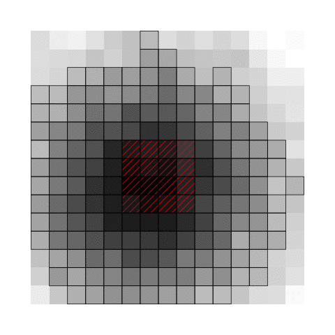

#Stabilized Sparse Online Learning for Sparse Data

This repository contains R codes for implementing the Stabilized Truncated Stochastic Gradient Descent algorithm in our paper Stabilized Sparse Online Learning for Sparse Data. See the original paper [here](https://arxiv.org/abs/1604.06498).

In the figure above, we present a demonstration of the Stabilized Truncated SGD algorithm in a simulation study. Each gird represents a feature in which the color scales with the absolute value of the associated weight. The red-shaded area highlights the true features with nonzero weights in the simulation. The bold outlines indicates the selected features (features with nonzero weights) after periodic soft truncations. The animation demonstrates that the proposed algorithm can effectively search for the true sparse combination of features using informative truncation and stability selection proposed in this paper.

### Summary

- The main algorithms are in `./lib/stsgd_algorithm_hinge.R` and `./lib/stsgd_algorithm_logistic.R`with hinge loss and logistic loss, respectively.
- All auxillary functions are saved in `./lib` as well as algorithms for comparison.
- An example of using the proposed algorithm on the Dexter data is given in `main.R`
- The Dexter dataset is stored in `./data`

###Reference 
Ma, Y. and Zheng, T. (2016), Stabilized Sparse Online Learning for Sparse Data. *arXiv preprint arXiv:1604.06498*
